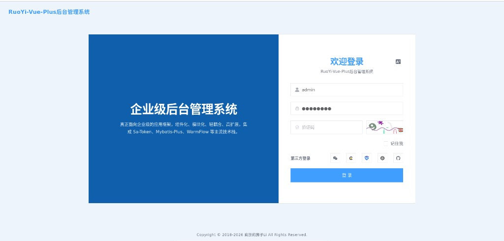
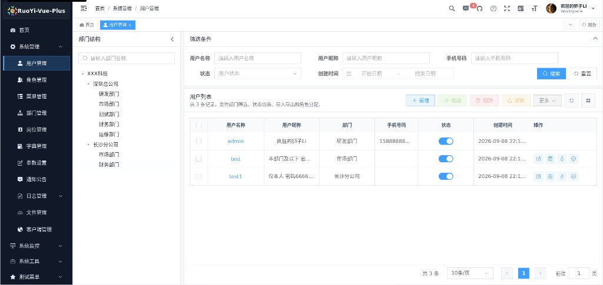
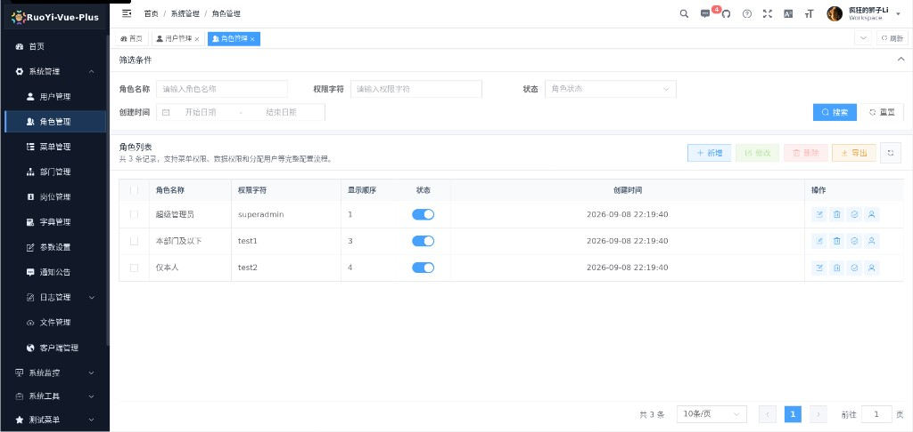
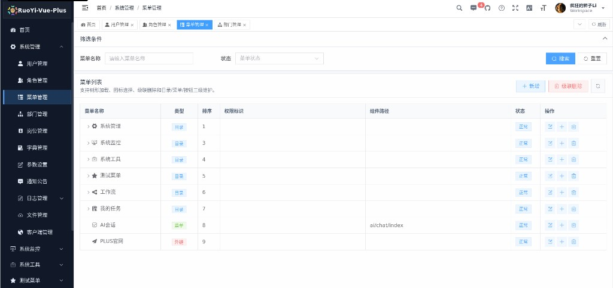
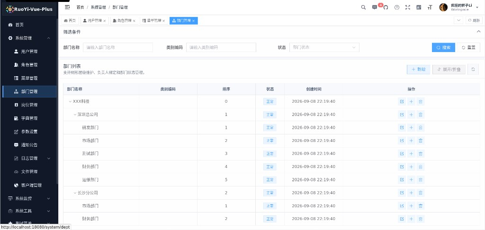
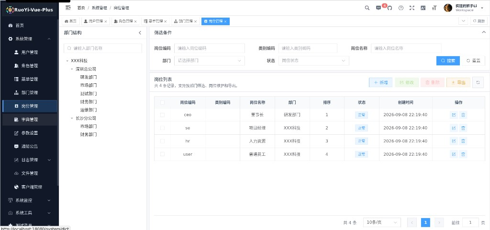
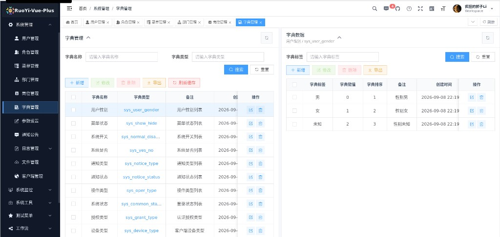

# plus-ui（Fork）

本仓库是 [RuoYi-Vue-Plus](https://gitee.com/dromara/RuoYi-Vue-Plus) 官方前端项目 [plus-ui](https://gitee.com/JavaLionLi/plus-ui)（`6.X-Vue`）的 **Fork**。

在保留官方业务能力与技术栈的基础上，对本仓库做了 **UI 与部分交互** 调整；会 **定期从官方仓库拉取并合并** 上游更新。

## 开源协议

本项目遵循上游 **[MIT License](./LICENSE)**。

- 上游版权归属：`Copyright (c) 2019 RuoYi-Vue-Plus`
- Fork 二次修改部分同样以 MIT 协议开源
- 使用、分发或再修改时，请保留原作者版权声明与许可证全文

官方项目地址：

- 前端：[Gitee JavaLionLi/plus-ui](https://gitee.com/JavaLionLi/plus-ui)
- 后端：[Gitee dromara/RuoYi-Vue-Plus](https://gitee.com/dromara/RuoYi-Vue-Plus) · [GitHub](https://github.com/dromara/RuoYi-Vue-Plus)

## 平台简介

- 技术栈：[Vue3](https://v3.cn.vuejs.org) + [TypeScript](https://www.typescriptlang.org/) + [Element Plus](https://element-plus.org/zh-CN) + [Vite](https://cn.vitejs.dev)
- 配套后端：RuoYi-Vue-Plus / RuoYi-Cloud-Plus（见下表）

### 本 Fork 相对官方的主要改动

- UI：直角风格、去渐变、去阴影/悬浮抬起，整体更扁平
- 布局：外层留白收紧，桌面端列表页更易撑满可视区域
- 表格：全局超长文本省略；部分页面交互与样式细节调整
- 登录 / 注册 / 首页等页面视觉统一为当前风格

业务功能仍以官方 RuoYi-Vue-Plus 为准；上游合并时优先保留本仓库 UI 定制。

## 配套后端代码仓库

| 介绍              | 项目名           | 项目地址                                                                                                                                                                       |
| ----------------- | :--------------- | ------------------------------------------------------------------------------------------------------------------------------------------------------------------------------ |
| 🔥 分布式集群框架 | RuoYi-Vue-Plus   | - [Gitee](https://gitee.com/dromara/RuoYi-Vue-Plus)<br> - [GitHub](https://github.com/dromara/RuoYi-Vue-Plus)<br> - [GitCode](https://gitcode.com/dromara/RuoYi-Vue-Plus)      |
| 🔥 微服务框架     | RuoYi-Cloud-Plus | - [Gitee](https://gitee.com/dromara/RuoYi-Cloud-Plus)<br>- [GitHub](https://github.com/dromara/RuoYi-Cloud-Plus)<br> - [GitCode](https://gitcode.com/dromara/RuoYi-Cloud-Plus) |

## 前端运行

```bash
# 安装依赖
pnpm install --registry=https://registry.npmmirror.com

# 启动服务
pnpm dev

# 构建生产环境
pnpm build:prod

# 前端访问地址以本地 .env.development 中的端口为准
```

## 演示图例

| 登录                                                                 | 用户管理                                                             |
| -------------------------------------------------------------------- | -------------------------------------------------------------------- |
|                                   |                                |
| 角色管理                                                             | 菜单管理                                                             |
|                                |                                |
| 部门管理                                                             | 岗位管理                                                             |
|                                |                                |
| 字典管理                                                             |                                                                      |
|                                |                                                                      |

## 致谢

感谢 [RuoYi-Vue-Plus](https://gitee.com/dromara/RuoYi-Vue-Plus) / [plus-ui](https://gitee.com/JavaLionLi/plus-ui) 原作者与社区的开源贡献。本 Fork 仅在其基础上做 UI 与部分体验调整，核心能力来自上游项目。
